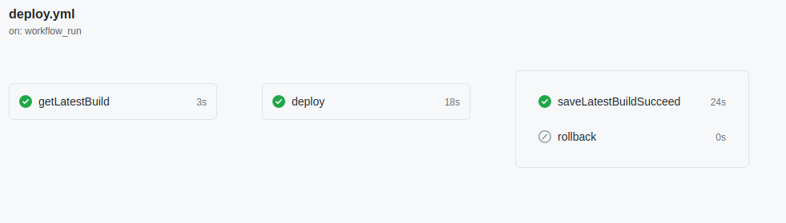

# Proyecto final bootcamp DevOps GeeksHubs

El objetivo del proyecto es montar un entorno de desarrollo con CI/CD en Deno

[Demo](http://188.166.149.195/)

## Tech
-  Deno
-  Alephjs
-  Docker
-  Git
-  Github actions
-  Puppeteer
-  DigitalOcean

## Filosofía

El proyecto se base en la filosofía DevOps. Pero además también se ha aplicado algunas más:

- DevOps
- GitOps
- Trunk base development
- SSR Server side rendering
- SSG Server side generation

## Workflows

Existen 5 Workflows (pipelines):

### Build and publish
En cada release con tag (semver), se construye una imagen stateless con todo el código necesario para funcionar por si misma.  La imagen se taggea con la version de la release (aleph-prod:0.0.0) y se publica en el registro de paquetes de github en este mismo repositorio.  Si la imagén se publica satisfactoriamente, se guarda la version publicada en `metadata/latestBuild`

https://github.com/jupegarnica?tab=packages&repo_name=aleph-deno

### Deploy

Este workflow se lanza cuando acaba el workflow build-publish.

Consiste en 4 Jobs:

- getLatestBuild: Lee `metadata/latestBuild`
- Se conecta por ssh al servidor de producción para realizar el swap de imágenes:
  - Hace pull de la nueva imagen
  - Para la imagen que corre actualmente
  - Arranca la nueva imagen.
- SaveLatestBuildSucceed:  Si el Job anterior acaba sin errores, guarda la version deployada en `metadata/latestBuildSucceed`
- rollback: Si el Job de deploy falla, este Job arranca la última imagen exitosa `metadata/latestBuildSucceed`

### Test producción

Al acabar el Workflow Deploy, este lanza los tests end2end contra el servidor de producción.
Si falla algún test, se recibe un email de aviso.

### Todos to issues

Este workflow monitoriza los comentarios TODO para crear, modificar o borrar issues del repositorio.

## Gh pages

Por cada release crea html estático y lo copia en la carpeta `/docs` para ser servido con github pages